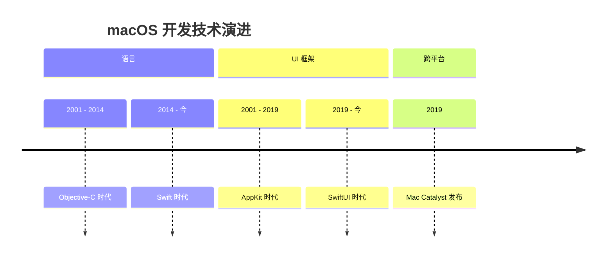

# macOS 开发技术演进

macOS，作为苹果操作系统的“长子”，其开发技术的演进历史悠久而深刻。从经典的 Mac OS 到现代的 macOS，其 UI 框架、编程语言和核心架构都经历了数次重大的变革。了解这段演进史，有助于我们理解当前技术的来龙去脉，以及苹果未来的发展方向。

## 1. Carbon 与 Cocoa：两大经典的 AppKit 框架

在 Mac OS X 早期，苹果提供了两个主要的应用程序框架：

*   **Carbon**: 这是一个 C 语言的 API，主要为了帮助开发者将他们为经典 Mac OS 9 编写的旧代码，相对轻松地迁移到新的、基于 Unix 的 Mac OS X 上。它是一个过渡性的框架，如今已完全被废弃。

*   **Cocoa**: 这是一个面向对象的、基于 Objective-C 的应用程序框架，它源自 NeXT 公司的 NeXTSTEP 操作系统。Cocoa 提供了 `AppKit` (用于 UI)、`Foundation` (用于非 UI 的基础功能) 和 `Core Data` (用于数据持久化) 等核心组件。**AppKit** 成为了之后近二十年里，macOS GUI 开发的唯一标准。我们熟悉的 `NSWindow`, `NSView`, `NSButton`, `NSTableView` 等都属于 AppKit。

## 2. Objective-C 与 Swift：编程语言的变革

*   **Objective-C**: 在 Swift 出现之前，Objective-C 是苹果生态系统开发的主要语言。它是一门动态的、面向对象的语言，是 C 语言的一个超集，并添加了 Smalltalk 风格的消息传递语法。它的语法（如 `[object method:argument]`）在今天看来可能有些冗长和古怪。

*   **Swift (2014年至今)**: 2014 年，苹果发布了 Swift，一门全新的、现代的、类型安全的编程语言。Swift 旨在变得更安全、更快速、更易于学习。它的出现极大地降低了苹果平台开发的门槛，并带来了许多现代语言特性，如可选类型（Optionals）、泛型、协议导向编程（POP）等。Swift 迅速取代了 Objective-C，成为苹果生态开发的首选语言。

## 3. 从 AppKit 到 SwiftUI：UI 框架的革命

*   **AppKit**: AppKit 是一个命令式（Imperative）的 UI 框架。你需要手动地创建、配置、布局和管理 UI 元素的生命周期。布局主要通过手动计算 `frame`、`autoresizingMask` 或更现代的 **Auto Layout** 约束系统来完成。它功能强大、成熟稳定，但代码量大，且 UI 逻辑与状态逻辑容易耦合在一起。

*   **SwiftUI (2019年至今)**: 2019 年，苹果发布了 SwiftUI，这是一个革命性的、**声明式（Declarative）**的 UI 框架。开发者只需要描述“UI 应该是什么样子”，而无需关心具体的实现步骤。SwiftUI 会根据应用的状态（State）自动地、高效地更新 UI。

    *   **跨平台**: SwiftUI 的设计初衷就是为了用一套代码，为所有苹果平台（macOS, iOS, watchOS, visionOS）构建应用。
    *   **数据驱动**: UI 是状态的函数，这是其核心思想。
    *   **实时预览**: Xcode Previews 极大地提升了 UI 开发的迭代效率。

## 4. Mac Catalyst：将 iPad 应用带到 Mac

在 SwiftUI 完全成熟之前，为了帮助 iOS 开发者将其庞大的应用生态带到 Mac 上，苹果推出了 Mac Catalyst。

*   **核心思想**: 它允许你将一个为 iPad 设计的、基于 `UIKit` 的应用，几乎不加修改地编译成一个原生的 Mac 应用。系统会自动将 `UIKit` 的组件（如 `UIButton`, `UITableView`）“翻译”成对应的 `AppKit` 组件（`NSButton`, `NSTableView`）。
*   **优势**: 对于已有的、复杂的 iPad 应用，这是将其移植到 Mac 上成本最低、速度最快的方式。
*   **局限**: “翻译”过程并不完美，生成的 Mac 应用有时会感觉不太“原生”，在菜单栏、工具栏、鼠标和键盘交互等方面，可能需要进行额外的适配工作才能提供良好的 Mac 体验。

## 技术演进的时间线

## 当前的开发选择

对于今天的 macOS 开发者来说，主要面临以下几种技术选择：

1.  **纯 SwiftUI**: 对于**新项目**，这无疑是**最佳选择**。它提供了最高的开发效率、最好的跨平台能力，并且代表了苹果未来的发展方向。

2.  **SwiftUI + AppKit**: 在一个 SwiftUI 应用中，当你需要使用 SwiftUI 尚未提供或 `AppKit` 中功能更成熟的组件时（例如 `NSCollectionView` 的某些高级用法），你可以通过 `NSViewRepresentable` 来将 `AppKit` 视图封装并嵌入到 SwiftUI 中。

3.  **AppKit + SwiftUI**: 在一个现有的、庞大的 `AppKit` 项目中，你可以使用 `NSHostingController` 来逐步地、渐进式地引入新的 SwiftUI 视图，从而在不重写整个应用的前提下，享受 SwiftUI 带来的开发便利。

4.  **Mac Catalyst**: 如果你已经有一个功能完善的 iPad 应用，并且希望快速地将其发布到 Mac App Store，Mac Catalyst 仍然是一个值得考虑的选项。

## 总结

macOS 的开发技术栈，已经从 `Objective-C + AppKit` 的经典组合，全面转向了以 **`Swift + SwiftUI`** 为核心的现代化范式。

SwiftUI 的声明式、数据驱动和跨平台特性，正在深刻地改变着我们构建 Mac 应用的方式。虽然 AppKit 作为一个成熟、强大的框架，在短期内不会消失，并且通过桥接协议与 SwiftUI 保持着良好的互操作性，但对于所有新的开发工作，拥抱 SwiftUI 无疑是拥抱未来。
