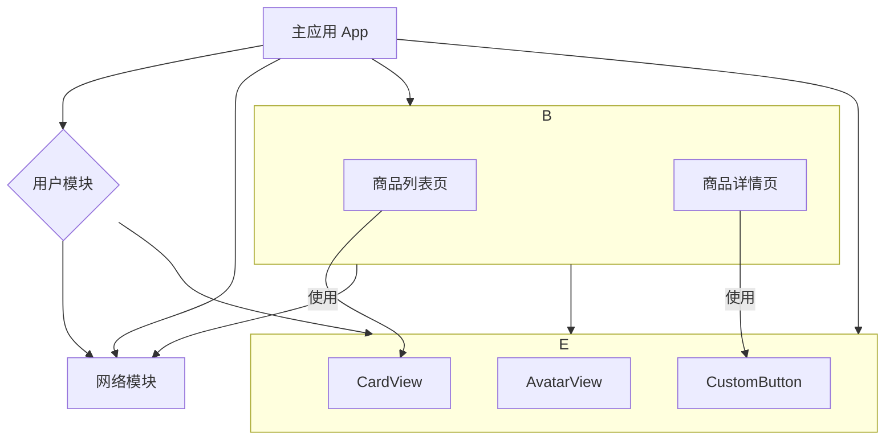

# 移动端架构：组件化与模块化

在现代移动应用开发中，**组件化（Componentization）**和**模块化（Modularization）**是应对应用规模和复杂性增长的两种核心架构思想。尽管它们经常被交替使用，但其侧重点和粒度有所不同。理解它们的区别与联系，是构建一个清晰、可维护、可扩展的应用架构的基础。

## 模块化 (Modularization)

模块化是一种**自上而下 (Top-Down)** 的架构拆分方式。它更侧重于从**业务或功能领域**的角度，将一个庞大的单体应用，拆分成多个独立的、高内聚的**模块**。

*   **粒度**: 较大。一个模块通常对应一个完整的业务功能或领域。
*   **例子**: 
    *   **业务模块**: 用户中心模块、商城模块、社交模块、订单模块。
    *   **功能模块**: 网络层模块、数据库模块、UI 基础组件库模块、分享模块。

### 模块化的目标

1.  **业务隔离**: 不同的业务团队可以独立负责自己的模块，减少团队间的耦合和干扰。
2.  **并行开发**: 多个模块可以并行开发和测试。
3.  **代码复用**: 基础功能模块（如网络、日志）可以在不同项目中复用。
4.  **提升编译速度**: 在开发时，可以只关注和编译当前正在开发的模块，而不是整个应用。

在 iOS 开发中，模块化通常通过创建独立的 **Frameworks** 或 **Swift Packages** 来实现。主应用工程（App Target）负责将这些模块集成起来。

## 组件化 (Componentization)

组件化是一种**自下而上 (Bottom-Up)** 的架构构建方式。它更侧重于从 **UI 和功能复用**的角度，将界面拆分成一个个独立的、可复用的**组件**。

*   **粒度**: 较小。一个组件可能只是一个按钮、一个头像视图、一个卡片，或者一个功能更完整的“业务组件”（如一个商品详情卡）。
*   **例子**:
    *   **基础 UI 组件**: `CustomButton`, `AvatarView`, `LoadingIndicator`。
    *   **业务组件**: `ProductCardView` (商品卡片), `CommentListView` (评论列表)。

### 组件化的目标

1.  **UI 复用**: 在应用的不同界面中，可以方便地复用同一个 UI 组件，保证视觉和交互的一致性。
2.  **降低 UI 复杂度**: 将复杂的界面拆分成由多个简单、独立的组件组合而成，使得每个组件的逻辑都非常清晰。
3.  **独立开发与测试**: 每个组件都可以被独立地开发、预览和进行单元/UI 测试。

SwiftUI 的设计思想本身就是高度组件化的。它鼓励开发者创建小巧、专注、可组合的 `View`，这与组件化的理念不谋而合。

## 两者的关系：相辅相成

模块化和组件化并不是互斥的，而是一个优秀架构中相辅相成的两个方面。

*   **模块化是大方向的“拆”**: 它定义了应用的高层结构和业务边界。
*   **组件化是小单元的“合”**: 它定义了构成每个模块 UI 界面的基础构建块。

一个典型的良好架构可能是这样的：



在这个架构中：
1.  应用被**模块化**为“商城模块”、“用户模块”、“网络模块”和“UI组件库模块”。
2.  “UI组件库模块”本身就是**组件化**思想的产物，它包含了一系列可在整个应用中复用的基础 UI 组件（`AvatarView`, `CustomButton` 等）。
3.  “商城模块”在构建自己的界面（如“商品列表页”）时，会使用这些来自“UI组件库模块”的基础组件。

## 在 Swift/SwiftUI 中实践

**Swift Package Manager (SPM)** 是在现代 Swift 项目中实践模块化和组件化的最佳工具。

你可以：
1.  **创建本地包 (Local Packages)**: 在你的 Xcode 项目中，为每个模块或组件库创建一个本地的 Swift Package。
2.  **定义产品 (Products)**: 在每个包的 `Package.swift` 文件中，定义一个或多个 `library` 产品，并声明其 `targets`。
3.  **管理依赖**: 在主应用的 Target Dependencies 中，添加你需要的本地包。同样，包与包之间也可以相互依赖。

### 示例项目结构

```
MySuperApp/
├── MySuperApp.xcodeproj
├── MySuperApp (App Target)
└── Packages/
    ├── Networking (网络模块)
    │   └── Package.swift
    ├── CommonUI (UI组件库)
    │   └── Package.swift
    ├── Profile (用户模块)
    │   └── Package.swift
    └── Store (商城模块)
        └── Package.swift
```

通过这种方式，你可以获得模块化和组件化带来的所有好处，同时 SPM 会自动为你处理复杂的依赖解析和编译链接。

## 总结

*   **模块化**是**宏观**的，它从业务角度将应用拆分成功能内聚的大块，关注的是**架构层面的解耦**。
*   **组件化**是**微观**的，它从 UI 和功能复用的角度将界面拆分成可组合的小单元，关注的是**代码和 UI 层面的复用**。

在一个成熟的大型应用中，这两种思想缺一不可。通过 SPM 等工具进行模块化拆分，并在每个模块内部以及公共库中大力推行组件化开发，是构建高质量、可维护、可扩展的现代移动应用的必经之路。
