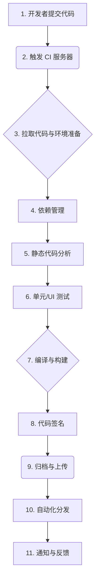

# 移动端自动化构建流程 (CI/CD)

自动化构建流程，通常被称为持续集成（Continuous Integration, CI）和持续交付/部署（Continuous Delivery/Deployment, CD），是现代软件开发中不可或缺的一环。它通过自动化的方式，将代码的集成、测试、构建和发布等一系列繁琐、重复性的任务串联起来，旨在提高开发效率、保证代码质量、并加快交付速度。

对于移动应用开发，一个成熟的 CI/CD 流程尤其重要，因为手动打包、签名、测试和上传到 App Store Connect / Google Play 是一个极其耗时且容易出错的过程。

## CI/CD 流程的核心阶段

一个典型的移动端 CI/CD 流程通常包含以下几个关键阶段：

1.  **代码提交 (Commit & Push)**: 开发者将本地代码推送到共享的代码仓库（如 Git）。

2.  **触发构建 (Trigger)**: 代码仓库通过 Webhook 通知 CI/CD 服务器（如 Jenkins, GitLab CI, GitHub Actions）有新的代码提交，从而自动触发一条新的构建流水线（Pipeline）。

3.  **环境准备 (Environment Setup)**: CI 服务器在一个干净的构建环境中（通常是 Docker 容器或虚拟机），拉取最新的代码，并设置好所需的环境变量、证书和工具（如特定版本的 Xcode, Ruby, Node.js）。

4.  **依赖管理 (Dependency Management)**: 执行 `pod install` (CocoaPods), `carthage bootstrap` (Carthage), 或 `swift package resolve` (SPM) 来下载和安装项目所需的所有第三方依赖库。

5.  **静态代码分析 (Static Analysis)**: 运行 SwiftLint, Clang Static Analyzer 等工具，检查代码风格是否统一、是否存在潜在的 bug 或“坏味道”。如果检查不通过，构建可以被中止。

6.  **自动化测试 (Automated Testing)**: 
    *   **单元测试 (Unit Tests)**: 运行项目中的单元测试用例，确保核心的业务逻辑和函数按预期工作。
    *   **UI 测试 (UI Tests)**: 运行 UI 测试用例，模拟用户操作，确保 UI 界面和交互流程的正确性。
    *   **代码覆盖率 (Code Coverage)**: 生成测试覆盖率报告，衡量测试的完备程度。

7.  **编译与构建 (Compile & Build)**: 调用 `xcodebuild` 命令来编译源代码，构建出 `.app` 文件。

8.  **代码签名 (Code Signing)**: 这是 iOS 开发特有的、非常关键的一步。CI 服务器需要访问正确的证书（Certificates）和配置文件（Provisioning Profiles）来对 `.app` 文件进行签名，以证明其来源可信并具备在真机上运行或上传到 App Store 的资格。

9.  **归档与上传 (Archive & Upload)**: 将签好名的 `.app` 文件打包成 `.ipa` (iOS) 或 `.pkg` (macOS) 归档文件，然后通过 `altool` 或 `notarytool` 等命令行工具，将其上传到 App Store Connect (或 TestFlight)。

10. **自动化分发 (Distribution)**: 
    *   对于内部测试版本，可以将 `.ipa` 文件自动上传到如 **Firebase App Distribution** 或 **蒲公英** 等内测分发平台，并通知测试人员。
    *   对于提交到 TestFlight 的版本，可以自动将其分发给指定的内部或外部测试员。
    *   对于正式版本，可以设置为手动提交审核，或在某些情况下（如果流程足够成熟）自动提交审核。

11. **通知与反馈 (Notification)**: 在流水线的每个关键步骤（如构建成功、测试失败、上传完成）后，通过 Slack、邮件或钉钉等方式，向开发团队发送通知。

## 主流 CI/CD 工具

*   **Jenkins**: 一个老牌、开源、功能极其强大的 CI/CD 服务器。它拥有庞大的插件生态系统，可以实现任何你能想到的自动化流程，但配置和维护相对复杂。

*   **GitLab CI/CD**: 如果你的代码仓库在 GitLab 上，那么使用其内置的 CI/CD 功能是最自然的选择。通过在项目中添加一个 `.gitlab-ci.yml` 文件来定义流水线，非常方便。

*   **GitHub Actions**: 与 GitLab CI/CD 类似，是 GitHub 官方推出的 CI/CD 服务。通过在仓库的 `.github/workflows/` 目录下创建 YAML 文件来定义工作流。它拥有一个活跃的市场（Marketplace），可以方便地复用社区贡献的各种 Action。

*   **fastlane**: 这不是一个完整的 CI/CD 服务器，而是一个专门为 iOS 和 Android 开发设计的**自动化工具集**。它将所有繁琐的命令行操作（如 `xcodebuild`, `altool`）都封装成了简单、易于使用的 Ruby 命令。几乎所有的 CI/CD 方案（无论是 Jenkins 还是 GitHub Actions）在处理 iOS 构建时，都会在其内部调用 fastlane 来执行具体的构建、签名和上传任务。**fastlane 是移动端自动化构建的事实标准**。

*   **Xcode Cloud** (官方方案): 苹果官方推出的、深度集成在 Xcode 和 App Store Connect 中的 CI/CD 服务。它极大地简化了环境配置和代码签名的复杂性，对于纯 SwiftUI 和 Swift 项目来说，是一个非常有吸引力的选择。

## 总结

搭建一套稳定、高效的自动化构建流程，是提升任何一个移动开发团队工程效率的关键投资。

*   **它解决了什么问题？**: 将手动、重复、易错的构建和发布过程自动化，解放了开发者的生产力。
*   **核心收益**: **提效**（减少等待和重复劳动）、**保质**（强制执行代码检查和自动化测试）、**加速交付**（更快地将新功能和修复交到用户手中）。
*   **关键工具**: 无论你选择哪种 CI/CD 服务器，**fastlane** 都是处理 iOS 构建任务不可或缺的瑞士军刀。而苹果官方的 **Xcode Cloud** 则为未来指明了一个更简单、更集成的方向。

对于任何一个超过一两个人的移动开发团队来说，尽早地投入时间和资源来建立 CI/CD 流程，都将获得长期的、巨大的回报。
