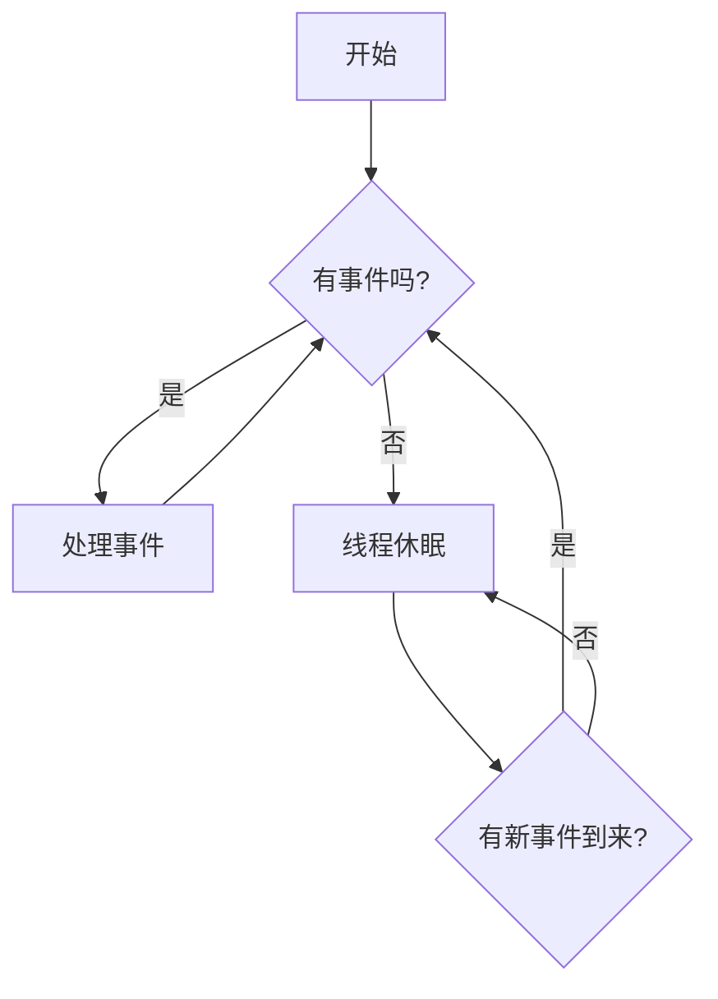

# RunLoop：iOS 事件处理的核心机制

RunLoop，直译为“运行循环”，是 iOS 和 macOS 应用中，与线程相关的、一个至关重要的基础架构。它本质上是一个事件处理循环，用于在一个线程上，接收和分发输入事件，并调度工作的执行。

虽然我们很少需要直接创建和管理 RunLoop，但理解其工作原理，对于我们理解 App 的事件响应、性能优化（特别是卡顿监控）和异步编程，都具有极其重要的意义。

## 核心理念：有事做事，没事休息

一个常规的线程，在执行完其任务后，就会退出。但对于像应用主线程这样的、需要持续存在的线程来说，我们不能让它在执行完一次任务后就退出。我们需要一种机制，让它能够“活”着，并随时准备处理新的事件（如用户触摸、定时器触发、网络回调等）。

RunLoop 就是这种机制。它的核心模型非常简单：

1.  **检查事件**: 检查当前线程是否有需要处理的事件源（Input Sources）或定时器源（Timer Sources）。
2.  **处理事件**: 如果有，就去处理这些事件。
3.  **进入休眠**: 如果没有任何事件需要处理，RunLoop 就会让当前线程进入休眠状态。这可以极大地节省 CPU 资源，避免线程空转。
4.  **被唤醒**: 当一个新的事件（如用户触摸屏幕）到来时，内核会唤醒 RunLoop，然后 RunLoop 回到第1步，开始新的循环。

## RunLoop 与线程的关系

*   **一一对应**: 每一个线程（`Thread`）都有其唯一对应的 RunLoop 对象。你不能自己创建 RunLoop，只能获取当前线程或主线程的 RunLoop。
*   **主线程默认开启**: 应用的主线程，在应用启动时，会自动地创建并运行其 RunLoop。这就是为什么你的应用能够持续地响应用户交互的原因。
*   **子线程默认不开启**: 对于你手动创建的子线程，其 RunLoop 是默认存在的，但并不会自动运行。你必须手动地调用其 `run()` 方法，才能“开启”这个循环。这通常只在你需要在子线程上，使用 `Timer` 或处理 `Port` 等基于 RunLoop 的事件时，才需要这样做。

## RunLoop 的核心组件

一个 RunLoop 主要由以下几个部分组成：

1.  **Mode (模式)**: 一个 RunLoop 可以运行在不同的“模式”下。一个模式，是一组要监控的输入源（Input Sources）和定时器源（Timer Sources），以及一组要通知的观察者（Observers）。
    *   **`default`**: 默认模式，主线程的大部分事件，都是在这个模式下处理的。
    *   **`tracking`**: 当用户在屏幕上滚动 `UIScrollView` 时，主线程的 RunLoop 会切换到这个模式。在这个模式下，默认的定时器等事件，将不会被处理。
    *   **`common`**: 这是一个“占位”模式。如果你想让一个事件源（如一个 `Timer`），能够在所有被标记为“common”的模式下（如 `default` 和 `tracking`）都能被处理，你就应该将其添加到 `commonModes` 中。

2.  **Sources (事件源)**: 
    *   **Input Sources (输入源)**: 负责分发异步事件。它们通常分为两类：
        *   **Port-Based Sources**: 基于内核的端口（Mach Port）进行通信，例如，接收其他进程或线程的消息。
        *   **Custom Input Sources**: 自定义的输入源。
    *   **Timer Sources (定时器源)**: 在预设的时间点，同步地触发事件，例如 `Timer`。

3.  **Observers (观察者)**: 允许你在 RunLoop 运行过程中的特定时间点（如即将处理事件、即将进入休眠、即将退出等），执行一些代码。卡顿监控等技术，就是通过监听 RunLoop 的状态切换来实现的。

## RunLoop 的实际应用

*   **UI 更新与事件响应**: 所有的用户触摸、屏幕刷新、UI 控件的事件（如按钮点击），都是在主线程的 RunLoop 中，被接收和分发的。

*   **`Timer`**: `Timer` 的触发，完全依赖于 RunLoop。如果你在一个没有运行 RunLoop 的子线程上，创建了一个 `Timer`，它将永远不会触发。

*   **`performSelector`**: `performSelector(afterDelay:)` 等延迟执行的方法，其底层也是通过向当前线程的 RunLoop 中，添加一个一次性的 `Timer` 来实现的。

*   **卡顿监控**: 这是 RunLoop 最重要的应用之一。我们可以通过添加一个 RunLoop Observer，来监控主线程 RunLoop 的状态切换。如果在两次状态切换之间（例如，从 `beforeSources` 到 `afterWaiting`）所花费的时间，超过了一个设定的阈值（例如 50 毫秒），我们就可以认为主线程发生了卡顿，并捕获当时的函数调用栈，进行分析。

## 总结

RunLoop 是 iOS/macOS 应用事件驱动模型的核心。它就像是每个线程的“心脏”，负责泵送和处理事件流。

*   **核心作用**: 保证线程在没有事件时休眠，在有事件时被唤醒并处理，从而实现了高效的事件驱动。
*   **主线程**: 应用的流畅性，完全依赖于主线程 RunLoop 的健康运行。任何在主线程上执行的耗时操作，都会阻塞 RunLoop，导致界面卡顿和事件响应延迟。
*   **性能优化**: 理解 RunLoop 的模式（特别是 `default` 和 `tracking` 的区别），以及其在卡顿监控中的应用，对于进行 App 的性能优化，至关重要。