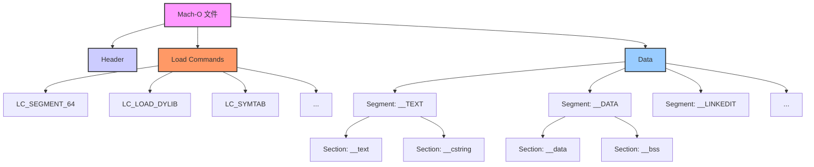

# Mach-O 文件格式

Mach-O（Mach Object）是 macOS 和 iOS 系统中，用于**可执行文件、动态库、目标文件、内核转储**等多种类型文件的标准格式。它是理解 App 的编译、链接、加载过程，以及进行深度的性能优化、安全分析和逆向工程的基础。

## Mach-O 文件的基本结构

一个 Mach-O 文件，主要由三个部分组成：

1.  **Header (头部)**: 位于文件的最开始，描述了该文件的基本信息，如：
    *   **Magic Number**: 用于标识这是一个 Mach-O 文件。
    *   **CPU Type**: 文件所适用的 CPU 架构（如 `arm64`）。
    *   **File Type**: 文件的类型（如 `MH_EXECUTE` - 可执行文件, `MH_DYLIB` - 动态库）。
    *   **Number of Load Commands**: 加载命令的数量。
    *   **Size of Load Commands**: 所有加载命令的总大小。

2.  **Load Commands (加载命令)**: 紧跟在 Header 之后，是一系列描述文件如何被加载到内存中的指令。每一条加载命令，都指定了文件中的某一部分（如代码段、数据段）应该被如何处理。

3.  **Data (数据区)**: 占据了文件的绝大部分空间，包含了实际的代码和数据。这部分被划分为多个“段”（Segment），每个段又可以被划分为多个“节”（Section）。

## 关键的段 (Segments) 和节 (Sections)

*   **`__TEXT` Segment**: 只读的代码和数据段。
    *   **`__text` Section**: 包含了编译后的、可执行的机器码。
    *   **`__stubs` 和 `__stub_helper`**: 用于动态链接的“桩代码”，用于在调用外部函数时，进行符号的懒加载（lazy binding）。
    *   **`__cstring` Section**: 包含了代码中使用的所有 C 语言字符串常量。
    *   **`__const` Section**: 包含了代码中使用的其他常量。

*   **`__DATA` Segment**: 可读写的数据段。
    *   **`__data` Section**: 包含了已经初始化的、可变的全局变量和静态变量。
    *   **`__bss` Section**: 包含了未初始化的全局变量和静态变量。这部分在文件中不占空间，在加载到内存时，才会被初始化为零。
    *   **`__objc_...` Sections**: 包含了一系列与 Objective-C 运行时相关的数据，如类定义、方法列表、协议等。

*   **`__LINKEDIT` Segment**: 包含了链接器用于链接和加载的元数据。
    *   **Symbol Table**: 符号表，包含了文件中定义和引用的所有符号（函数名、变量名）的信息。
    *   **String Table**: 字符串表，存储了符号表中所使用的所有字符串。
    *   **Rebase/Binding Info**: 用于动态链接器进行重定位和绑定的信息。

## Mach-O 与 App 启动

当用户点击 App 图标时，操作系统内核会执行以下操作：

1.  **创建进程**: 为 App 创建一个新的进程。
2.  **加载 `dyld`**: 将动态链接器（`dyld`）加载到进程的地址空间中。
3.  **加载主可执行文件**: 内核读取 App 的主可执行文件（一个 Mach-O 文件）的 Header 和 Load Commands，并根据其中的 `LC_SEGMENT_64` 命令，将文件的各个段，通过 `mmap` 映射到进程的虚拟地址空间中。
4.  **移交控制权**: 内核将控制权，移交给 `dyld`。
5.  **`dyld` 的工作**: `dyld` 开始执行 `pre-main` 阶段的工作，包括：
    *   根据 `LC_LOAD_DYLIB` 命令，递归地加载所有依赖的动态库。
    *   根据 `__LINKEDIT` 段中的信息，对所有符号进行重定位（Rebasing）和绑定（Binding）。
    *   执行所有的 Objective-C `+load` 方法和 C++ 静态初始化器。
6.  **调用 `main` 函数**: 在完成所有准备工作后，`dyld` 调用主可执行文件中的 `main` 函数，App 的启动过程进入 `main` 阶段。

## 分析工具

*   **`otool`**: 一个强大的命令行工具，可以用来查看 Mach-O 文件的各种信息。例如，`otool -L` 可以查看一个文件依赖的所有动态库；`otool -h` 可以查看其 Header。

*   **`MachOView`**: 一个第三方的、可视化的 Mach-O 文件浏览器，是进行底层分析的利器。

*   **Link Map 文件**: 虽然不是直接分析 Mach-O 文件，但它提供了关于最终二进制文件构成的大量信息，是进行包体积分析的关键。

## 总结

Mach-O 文件格式，是苹果操作系统底层的一个基石。对于大多数应用层开发者来说，我们无需直接操作它。但理解其基本结构和加载过程，对于我们进行以下高级优化和分析，具有重要的意义：

*   **启动性能优化**: 理解 `dyld` 的加载过程，是优化 `pre-main` 阶段耗时的基础。
*   **包体积优化**: 通过分析 `__TEXT` 段的大小和 Link Map 文件，可以精确地知道是哪些代码和库，占据了我们的包体积。
*   **逆向工程与安全**: 许多逆向工程技术，如动态库注入（`LC_LOAD_DYLIB`）、符号 Hook（修改 `__DATA` 段中的函数指针），都是通过直接修改 Mach-O 文件来实现的。

Mach-O 文件，就像是 App 的“基因图谱”。学会解读它，能让我们从一个更底层的视角，去理解和优化我们的应用程序。