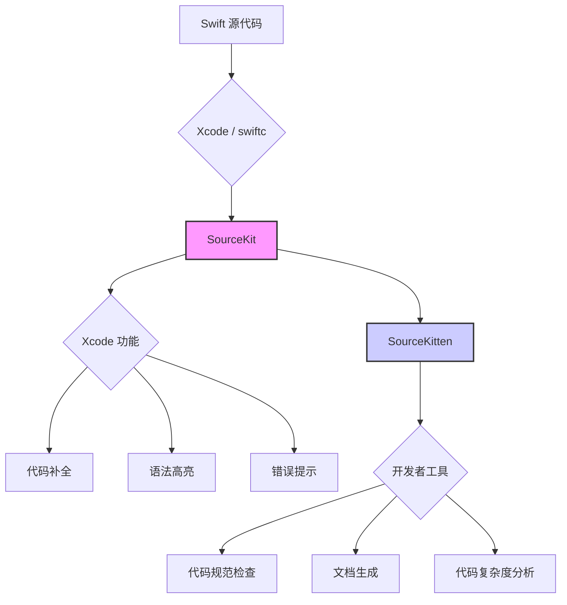

# SourceKitten: Swift 静态分析的利器

`SourceKitten` 是一个基于 `SourceKit` 的命令行工具和 Swift 框架，它为开发者提供了一个与 Swift 编译器内部交互的桥梁。通过 `SourceKitten`，我们可以获取到关于 Swift 代码的丰富信息，如语法结构、类型信息、文档注释等，从而实现各种强大的静态分析功能。

## SourceKit 与 SourceKitten 的关系

*   **`SourceKit`**: 是一个内嵌在 Swift 编译器（`swiftc`）和 Xcode 中的框架。它是 Xcode 能够提供代码补全、语法高亮、错误提示、跳转到定义等功能的幕后功臣。`SourceKit` 能够深入理解 Swift 代码的语义，并以一种结构化的方式，提供这些信息。

*   **`SourceKitten`**: 可以看作是 `SourceKit` 的一个“客户端”。它封装了与 `SourceKit` 交互的复杂细节，并以更友好的方式（如 JSON、Swift 字典）将 `SourceKit` 返回的数据，呈现给开发者。这使得我们无需深入了解 `SourceKit` 的底层实现，就能够利用其强大的代码分析能力。



## SourceKitten 的核心功能

`SourceKitten` 提供了丰富的命令行指令，用于从不同维度分析 Swift 代码：

*   **`sourcekitten doc`**: 解析 Swift 文件中的文档注释（Doc Comments），并以 JSON 或 Xcode-Quick-Help 的格式输出。这是自动化生成 API 文档的基础。著名的文档生成工具 `Jazzy` 就是基于此功能构建的。

*   **`sourcekitten structure`**: 分析 Swift 文件的语法结构，并以 JSON 格式输出一个抽象语法树（AST）的子集。这个 AST 包含了代码中所有的声明，如类、结构体、枚举、函数、变量等，以及它们之间的层级关系。

*   **`sourcekitten syntax`**: 对 Swift 文件进行语法分析，并输出一个包含了所有语法标记（Token）的列表。每个 Token 都包含了其类型（如 `keyword`, `identifier`, `string_literal`）和在文件中的位置。这是实现自定义语法高亮、代码格式化等功能的基础。

*   **`sourcekitten complete`**: 模拟 Xcode 的代码补全功能。给定一个文件路径和光标位置，它可以返回在该位置所有可能的代码补全建议。

## SourceKitten 的应用场景

`SourceKitten` 的强大能力，使其成为许多知名 Swift 开发工具的基石：

1.  **代码规范与风格检查 (Linter)**
    *   **`SwiftLint`**: 是目前最流行的 Swift Linter。它通过 `sourcekitten syntax` 和 `sourcekitten structure` 获取代码的语法结构，然后根据一系列预设的规则（如“单行代码不应超过 120 个字符”、“不应使用强制解包”）来检查代码是否符合规范。开发者也可以基于 `SourceKitten` 返回的 AST，轻松地编写自定义的 linting 规则。

2.  **API 文档生成**
    *   **`Jazzy`**: 通过 `sourcekitten doc` 提取代码中的文档注释，并自动生成漂亮的 HTML 格式的 API 文档。这极大地简化了维护项目文档的工作。

3.  **代码复杂度分析**
    *   我们可以通过分析 `sourcekitten structure` 返回的 AST，来计算代码的复杂度指标，如圈复杂度（Cyclomatic Complexity）。这有助于我们识别出那些过于复杂、难以维护的函数或类，并进行重构。

4.  **代码生成与重构**
    *   一些工具可以利用 `SourceKitten` 来分析现有代码，并自动生成一些模板代码（Boilerplate Code），如 `Mocks`、`Lenses` 等。同样，也可以基于 AST 进行安全的、大规模的代码重构。

## 如何使用 SourceKitten

`SourceKitten` 可以通过 Homebrew 或 Swift Package Manager 进行安装。

**通过 Homebrew 安装:**
```bash
brew install sourcekitten
```

**基本用法示例:**

假设我们有一个名为 `MyClass.swift` 的文件：
```swift
/// 这是一个用于演示的类。
class MyClass {
    /// 一个示例属性。
    let myProperty: Int = 0

    /// 一个示例方法。
    /// - Parameter input: 输入参数。
    /// - Returns: 返回一个字符串。
    func myMethod(input: String) -> String {
        return "Hello, \(input)!"
    }
}
```

我们可以运行以下命令：

*   **查看文档:**
    ```bash
    sourcekitten doc -- -project MyProject.xcodeproj -scheme MyScheme
    ```
    *(注意: 为了让 SourceKit 能够正确解析模块依赖，通常需要提供项目的编译参数，如 `-project` 和 `-scheme`)*

*   **查看语法结构:**
    ```bash
    sourcekitten structure --file MyClass.swift
    ```

## 总结

`SourceKitten` 为 Swift 社区提供了一个强大而灵活的静态分析引擎。它通过将 `SourceKit` 的能力，暴露给命令行和 Swift 框架，极大地促进了 Swift 开发工具生态的繁荣。从代码规范检查、文档生成，到复杂的代码分析与重构，`SourceKitten` 都是一个不可或缺的工具。对于希望提升团队代码质量、自动化开发流程的 iOS/macOS 开发者来说，学习和利用 `SourceKitten` 及其生态工具，是一项非常有价值的投资。