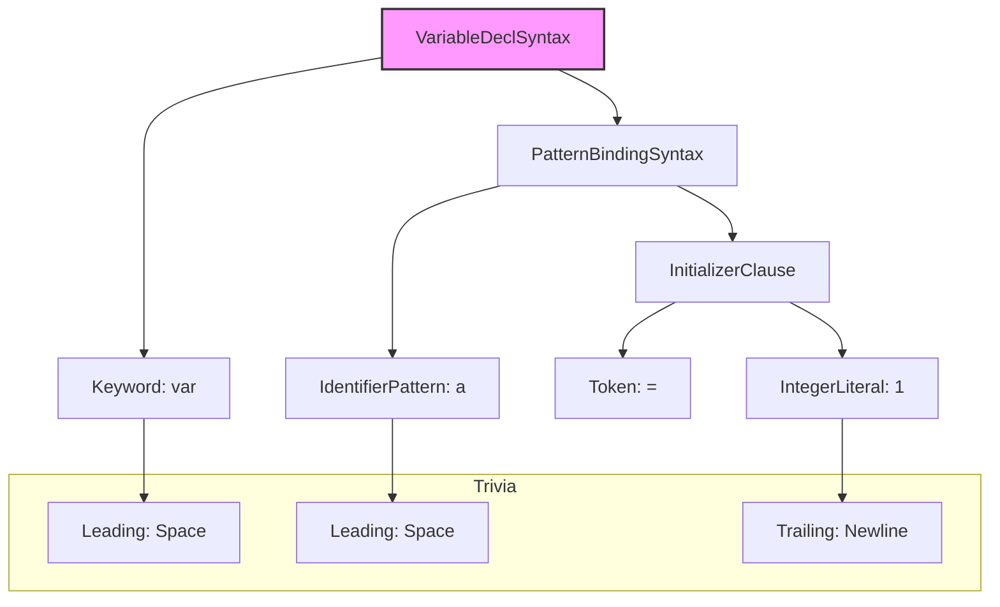

# SwiftSyntax: 解析、转换和生成 Swift 代码

`SwiftSyntax` 是一个由 Apple 开发和维护的 Swift 库，它提供了一套强大的工具，用于**解析、检查、转换和生成** Swift 源代码。它将 Swift 代码，表示为一个可供程序操作的、结构化的数据格式——语法树（Syntax Tree）。

`SwiftSyntax` 是 Swift 编译器和 Xcode 自身功能（如代码格式化、重构、宏）的基石，也为社区构建高质量的开发者工具，提供了前所未有的能力。

## 核心理念：保真语法树 (Fidelity)

与传统的抽象语法树（AST）不同，`SwiftSyntax` 生成的是一个**具体语法树（Concrete Syntax Tree, CST）**，或者说是一个**“保真”**的语法树。这意味着它会保留源文件中的**所有**信息，包括：

*   **代码逻辑**: 变量声明、函数调用、控制流等。
*   **琐碎信息 (Trivia)**: 如**空格、换行、注释**等。
*   **所有标点符号**: 如括号 `()`、花括号 `{}`、逗号 `,` 等。

这种“保真”的特性至关重要。因为它意味着，当你修改了语法树并将其转换回代码时，所有未被修改的部分（包括代码格式和注释）都能**完美地保持原样**。这对于编写代码格式化器、重构工具等，至关重要。

### 示例：一个简单的语法树

对于一行简单的代码 `var a = 1`，`SwiftSyntax` 会将其解析为一个层级结构：



这个树精确地表示了 `var` 关键字、标识符 `a`、等号 `=` 和字面量 `1`，以及它们之间的空格。

## `SwiftSyntax` 的主要组件

1.  **`SyntaxNode` (语法节点)**: 这是构成语法树的基本单位。每个节点都代表了源代码中的一个特定部分，如一个声明、一个表达式或一个语句。所有的节点类型，都以 `Syntax` 结尾，如 `FunctionDeclSyntax` (函数声明), `IfStmtSyntax` (if 语句)。

2.  **`SyntaxVisitor` (语法访问者)**: 这是遍历语法树的核心工具。开发者可以创建一个 `SyntaxVisitor` 的子类，并重写 `visit(_:)` 方法，来访问特定类型的节点。例如，你可以编写一个 Visitor，来统计一个文件中所有函数声明的数量，或者找出所有被强制解包的可选值。

    ```swift
    class FunctionCounter: SyntaxVisitor {
        var count = 0
        // 当访问到一个函数声明节点时，此方法会被调用
        override func visit(_ node: FunctionDeclSyntax) -> SyntaxVisitorContinueKind {
            count += 1
            return .visitChildren // 继续访问子节点
        }
    }
    ```

3.  **`SyntaxRewriter` (语法重写器)**: 这是用于**修改**语法树的工具。与 `SyntaxVisitor` 类似，你可以通过重写 `visit(_:)` 方法来访问节点，但不同的是，你可以返回一个**新的、被修改过的节点**来替换原有的节点。`SwiftSyntax` 会用你返回的新节点，构建一个新的语法树。这是实现代码重构、迁移和自动修复功能的基础。

## `SwiftSyntax` 的应用

`SwiftSyntax` 的出现，催生了一系列强大的 Swift 开发工具：

*   **代码格式化 (Formatting)**
    *   **`swift-format`**: Apple 官方出品的代码格式化工具，它完全基于 `SwiftSyntax` 构建，能够以高度一致的风格，重排你的代码，同时完美保留注释和逻辑。

*   **代码规范检查 (Linting)**
    *   新一代的 Linter 工具，可以利用 `SwiftSyntax` 对代码进行更深入、更精确的语义分析，从而发现更复杂的潜在问题。

*   **代码迁移与重构**
    *   当 Swift 语言引入新的语法或废弃旧的语法时，Xcode 使用 `SwiftSyntax` 来提供“一键迁移”的功能，自动更新用户的项目代码。

*   **Swift Macros (Swift 5.9 及以上)**
    *   这是 `SwiftSyntax` 最具革命性的应用。Swift Macros 允许开发者在编译时，通过代码生成代码。一个宏，本质上就是一个接收 `SwiftSyntax` 树作为输入，并返回一个新的 `SwiftSyntax` 树作为输出的函数。这使得我们可以消除大量的模板代码，创建富有表现力的新 DSL，极大地扩展了 Swift 语言的能力。
    *   例如，`@Observable` 宏，就是通过解析类的定义，并自动为其添加所有必要的代码，来实现可观测性的。

## `SwiftSyntax` vs. `SourceKitten`

| 特性 | `SourceKitten` | `SwiftSyntax` |
| :--- | :--- | :--- |
| **核心** | 对 `SourceKit` 服务的高层封装 | 一个独立的 Swift 源代码解析库 |
| **数据结构** | JSON 或 Swift 字典 | 类型安全的“保真”语法树 |
| **主要用途** | 获取代码结构、文档、语法高亮信息 | 解析、转换、重写和生成代码 |
| **修改能力** | 无 | 强大的、保真的代码重写能力 |
| **典型工具** | `Jazzy`, `SwiftLint` (旧模式) | `swift-format`, Swift Macros, `SwiftLint` (新模式) |

总的来说，`SourceKitten` 更像是一个“只读”的分析工具，而 `SwiftSyntax` 则是一个功能更强大、更底层的“读写”工具，特别适合于那些需要修改和生成代码的场景。

## 总结

`SwiftSyntax` 是 Swift 工具链中一个至关重要的组成部分。它将 Swift 编译器的核心技术，开放给了所有开发者，使我们能够以前所未有的方式，来分析、理解和操作 Swift 代码。随着 Swift Macros 的普及，理解 `SwiftSyntax` 的基本原理，对于每一位希望走在技术前沿的 Swift 开发者来说，都将变得越来越重要。