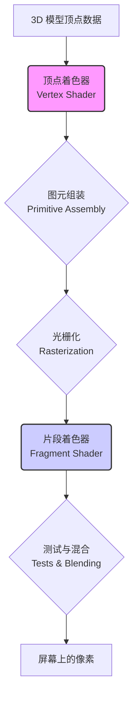

# 什么是着色器 (Shader)？

着色器（Shader）是在 GPU（图形处理器）上运行的一段用户自定义的程序。它的核心任务是，告诉计算机，场景中的物体（无论是 3D 模型，还是 2D 图像）的每一个点，应该如何被“着色”——即它应该是什么颜色，以及它如何对光照、纹理和其他效果做出反应。

在现代计算机图形学中，几乎所有我们能在屏幕上看到的、酷炫的视觉效果，都是通过着色器来实现的。它们是连接 3D 数据和最终 2D 像素的桥梁，是实时图形渲染的灵魂。

## 图形渲染管线 (Graphics Pipeline)

要理解着色器，首先需要了解它在图形渲染管线中的位置。渲染管线是一个将 3D 场景的几何描述，转换为屏幕上的 2D 图像的、高度流水线化的过程。这个管线主要包含两个由开发者编程的核心阶段：

1.  **顶点着色器 (Vertex Shader)**
2.  **片段着色器 (Fragment Shader / Pixel Shader)**

### 1. 顶点着色器 (Vertex Shader)

*   **运行单位**: 为 3D 模型的**每一个顶点**，都独立地、并行地运行一次。
*   **核心任务**: **计算顶点的位置**。它的主要工作，是接收一个在“模型空间”中的顶点坐标，然后通过一系列的矩阵变换（模型矩阵、视图矩阵、投影矩阵），将其转换到最终的“裁剪空间”中。这个过程，决定了一个顶点，最终会出现在屏幕的哪个位置。
*   **其他任务**: 除了位置变换，顶点着色器还可以处理每个顶点的其他属性，例如，传递颜色、法线、纹理坐标等信息给下一个阶段。

**简单来说，顶点着色器决定了“画什么”和“在哪里画”。**

### 2. 片段着色器 (Fragment Shader / Pixel Shader)

在顶点着色器处理完所有顶点，并通过“图元组装”和“光栅化”阶段后，GPU 就知道了场景中的三角形，会覆盖屏幕上的哪些像素。这些“潜在的像素”，被称为“**片段 (Fragments)**”。

*   **运行单位**: 为光栅化产生的**每一个片段**，都独立地、并行地运行一次。
*   **核心任务**: **计算片段的颜色**。这是着色器最有趣、也最具创造力的部分。片段着色器会接收来自顶点着色器传递过来的、经过插值的各种属性（如位置、颜色、法线、纹理坐标），并根据这些信息，来计算出这个片段最终应该是什么颜色。
*   **可以做什么**: 
    *   **纹理映射**: 根据纹理坐标，从一张图片（纹理）中，采样颜色。
    *   **光照计算**: 根据物体的法线、光源的位置和颜色，来计算逼真的光照和阴影效果（如 Phong 光照模型、Blinn-Phong 模型）。
    *   **程序化生成**: 完全不依赖任何外部输入，仅仅通过数学函数（如噪点函数、SDF），来程序化地生成颜色和图案。
    *   **后期处理**: 对整个渲染完成的图像，进行模糊、辉光、颜色校正等后期处理。

**简单来说，片段着色器决定了“怎么画”和“画成什么颜色”。**

## 着色器语言

编写着色器，需要使用专门的、类似于 C 语言的“着色器语言”。

*   **GLSL (OpenGL Shading Language)**: 用于 OpenGL 和 WebGL 标准的着色器语言。
*   **HLSL (High-Level Shading Language)**: 用于微软的 DirectX 图形 API 的着色器语言。
*   **Metal Shading Language (MSL)**: 用于苹果的 Metal 图形 API 的着色器语言。

这些语言虽然在语法细节上有所不同，但其核心概念和结构（如 `main` 函数、向量类型 `vec2/vec3/vec4`、矩阵类型 `mat4`、以及用于纹理采样的 `texture()` 函数）都是非常相似的。

## 为什么着色器如此重要？

1.  **可编程性与灵活性**: 在固定功能的渲染管线时代，开发者只能使用由硬件厂商预设好的、有限的光照和渲染效果。着色器的出现，将渲染管线的两个核心阶段，开放给了开发者，使得几乎无限的、自定义的视觉效果，成为了可能。

2.  **并行计算**: 着色器天生就是为大规模并行计算而设计的。GPU 可以同时运行数千个着色器实例，来处理数千个顶点或片段。这种架构，是实现高帧率、实时图形渲染的关键。

3.  **通用计算 (GPGPU)**: 着色器的并行计算模型，被证明非常适用于图形渲染之外的、任何计算密集型的任务。现代 GPU 上的“计算着色器 (Compute Shaders)”，已经被广泛地应用于机器学习、物理模拟、密码学等领域。

## 总结

*   **着色器**是在 GPU 上运行的、用于**计算颜色**的小程序。
*   **顶点着色器**处理**每个顶点**，决定其**位置**。
*   **片段着色器**处理**每个像素**（片段），决定其**最终颜色**。
*   着色器赋予了开发者**控制渲染过程的灵活性和可编程性**，是创造所有现代计算机图形视觉效果的基础。
*   其**大规模并行**的计算模型，不仅是实时图形的核心，也成为了通用目的 GPU 计算（GPGPU）和现代 AI 的基石。

从本质上讲，学习编写着色器，就是学习如何直接与 GPU 对话，学习如何用数学和算法，来创造一个生动、美丽、可交互的视觉世界。
