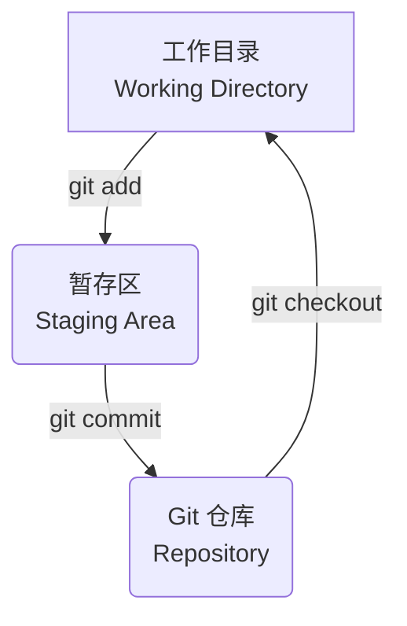

# Git 版本控制系统

Git 是一个开源的、分布式的**版本控制系统 (Version Control System, VCS)**，由 Linux 的创始人 Linus Torvalds 于 2005 年开发。它被设计用来高效、敏捷地处理从小型到非常大型的项目的版本管理。在今天，Git 已经成为了全世界软件开发领域，最主流、最核心、也是必须掌握的工具，没有之一。

## 核心理念

要理解 Git，首先需要理解其与传统版本控制系统（如 SVN）的两个根本区别：

1.  **分布式 (Distributed)**: 在 SVN 这样的集中式系统中，所有的版本历史，都只存储在一个中央服务器上。开发者在自己的本地，只拥有某个特定版本的“工作副本”。而在 Git 中，每一个开发者的本地，都拥有一个**完整的、包含所有历史记录的克隆 (Clone)**。这意味着：
    *   **离线工作**: 你可以在没有网络连接的情况下，进行提交、查看历史、创建分支等几乎所有的操作。
    *   **速度快**: 大多数操作，都是在本地进行的，无需通过网络与服务器交互，因此速度极快。
    *   **数据安全**: 即使中央服务器崩溃，任何一个开发者的本地克隆，都可以被用来恢复整个项目。

2.  **快照，而非差异 (Snapshots, not Differences)**: Git 不像其他系统那样，记录每个文件随时间变化的“差异 (Deltas)”。相反，Git 在每次你**提交 (Commit)** 时，都会对你代码库的**所有文件**，创建一个“**快照 (Snapshot)**”，并存储一个指向这个快照的引用。
    *   为了效率，如果文件没有被修改，Git 不会重复存储它，而只是存储一个指向上一次已存储文件的链接。
    *   这种基于快照的设计，使得 Git 在处理分支、合并等操作时，模型更简单、也更强大。

## Git 的三个区域

一个 Git 项目，主要由三个核心的区域组成：

1.  **工作目录 (Working Directory)**: 这是你当前正在进行修改的、实际的文件系统中的项目文件夹。

2.  **暂存区 (Staging Area / Index)**: 这是一个位于 `.git` 目录中的文件，它记录了你**下一次将要提交**的文件的快照信息。暂存区，就像一个“购物车”，允许你在提交之前，精心挑选和准备你想要包含在下一次提交中的内容。

3.  **Git 仓库 (Git Repository / `.git` Directory)**: 这是 Git 用来存储项目元数据和对象数据库的地方。每一次 `git commit`，都会将暂存区的内容，永久地保存到这个仓库中，形成一个新的“提交记录”。

**基本工作流**: 
1.  在**工作目录**中，修改文件。
2.  使用 `git add` 命令，将你想要提交的文件的快照，添加到**暂存区**。
3.  使用 `git commit` 命令，将**暂存区**的内容，永久地记录到 **Git 仓库**中。

## 常用 Git 命令

*   **`git init`**: 在当前目录，初始化一个新的 Git 仓库。
*   **`git clone <url>`**: 从一个远程服务器（如 GitHub），克隆一个完整的项目仓库到本地。

*   **`git status`**: 查看当前工作目录和暂存区的状态，显示哪些文件被修改了、哪些文件被暂存了。
*   **`git add <file>`**: 将一个文件的修改，添加到暂存区。
*   **`git commit -m "<message>"`**: 将暂存区的内容，创建一个新的提交，并附上一段描述性的消息。

*   **`git log`**: 显示从最近到最远的提交历史记录。
*   **`git diff`**: 显示工作目录中的文件，与暂存区或上一次提交之间的差异。

*   **`git branch <branch-name>`**: 创建一个新的分支。
*   **`git checkout <branch-name>`** (或 `git switch <branch-name>`): 切换到另一个分支。
*   **`git merge <branch-name>`**: 将另一个分支的修改，合并到当前分支。

*   **`git pull`**: 从远程仓库，拉取最新的修改，并与你的当前分支进行合并。
*   **`git push`**: 将你的本地提交，推送到远程仓库。

## 分支：Git 的“杀手级”特性

分支是 Git 最强大、也是与其他 VCS 区别最开来的特性。在 Git 中，创建一个分支，是一个极其轻量、快速的操作。它本质上，只是创建了一个指向某个特定提交记录的、可移动的**指针**。

这使得开发者可以，并且应该，为**每一个新功能、每一个 Bug 修复**，都创建一个新的、独立的“**特性分支 (Feature Branch)**”。

**分支工作流 (GitHub Flow)**:
1.  从 `main` 分支，创建一个新的特性分支（例如 `feature/add-login-button`）。
2.  在这个新的分支上，进行你的所有开发和提交。
3.  当你完成这个功能后，将这个分支，推送到远程服务器。
4.  在 GitHub (或 GitLab) 上，创建一个“**拉取请求 (Pull Request, PR)**”。这是一个请求，请求团队的其他成员，来审查你的代码，并将其合并回 `main` 分支。
5.  在经过代码审查、讨论和自动化测试后，你的分支，最终被合并到 `main` 分支中。

**优势**: 
*   **隔离性**: 不同的功能开发，在各自的分支中，互不干扰。
*   **安全性**: `main` 分支始终保持稳定、可发布的状态。所有不稳定的、正在开发中的代码，都在特性分支中。
*   **代码审查**: Pull Request 提供了一个天然的、进行代码审查和团队协作的平台。

## 总结

*   **核心理念**: Git 是一个**分布式**的版本控制系统，它以**快照**的方式，来记录历史。
*   **三大区域**: **工作目录**、**暂存区**和 **Git 仓库**，是你需要理解的核心工作区。
*   **基本流程**: `add` -> `commit` -> `push`。
*   **分支是核心**: 要养成“为每一个独立的任务，都创建新分支”的习惯。这会让你的开发流程，变得清晰、安全、且易于协作。

Git 的学习曲线，可能比其他一些工具要陡峭，但它所带来的生产力提升和协作便利性，是无与伦比的。在现代软件开发中，熟练地掌握 Git，已经不再是一项“加分项”，而是一项与“会写代码”同等重要的、必备的基础技能。
