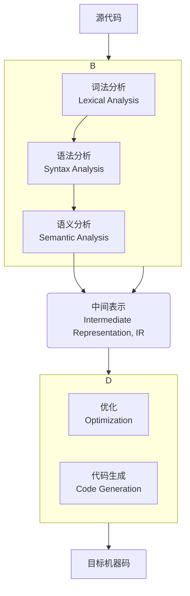

# 什么是编译器？

编译器（Compiler）是一种计算机程序，它的核心任务，是将用一种**高级编程语言**（如 Swift, C++, Java）编写的**源代码 (Source Code)**，**翻译**成另一种**低级语言**（通常是目标 CPU 能够直接执行的**机器码 (Machine Code)**）。

这个翻译过程，是在程序**运行之前**，**一次性**完成的。编译器，就像一个专业的“翻译家”，他会先将整本中文小说（源代码），完整地翻译成一本英文小说（可执行文件），然后再交给读者（CPU）去阅读。

## 编译器的主要工作阶段

编译器的内部工作流程，极其复杂，但通常可以被划分为几个主要的前后阶段，这被称为“**编译器前端 (Front End)**”和“**编译器后端 (Back End)**”。

### 1. 前端 (Front End)

前端的主要职责，是**理解**源代码，并检查其是否符合语言的语法和语义规则。它与最终的目标机器架构无关。

*   **词法分析 (Lexical Analysis)**: 
    *   **任务**: 将原始的、字符串形式的源代码，分解成一系列有意义的、最小的“**词元 (Tokens)**”。
    *   **例子**: 对于代码 `var a = b + 10;`，词法分析器会将其分解为：`var` (关键字), `a` (标识符), `=` (操作符), `b` (标识符), `+` (操作符), `10` (字面量), `;` (分隔符)。

*   **语法分析 (Syntax Analysis)**: 
    *   **任务**: 根据语言的“**语法规则 (Grammar)**”，来检查这些词元序列，是否构成了一个结构上合法的句子。它会将线性的词元流，组织成一个树状的、能够表示程序结构的“**抽象语法树 (Abstract Syntax Tree, AST)**”。
    *   **例子**: 如果你写了 `var a = + 10;`，语法分析器就会报错，因为它不符合变量声明的语法规则。

*   **语义分析 (Semantic Analysis)**: 
    *   **任务**: 检查语法上正确的代码，在“**意思**”上是否也正确。它会进行类型检查、作用域检查等。
    *   **例子**: 如果你写了 `var a: String = 10;`，虽然语法结构正确，但语义分析器会报错，因为它违反了“不能将一个整数，赋值给一个字符串类型变量”的语义规则。

### 2. 中间表示 (Intermediate Representation, IR)

在前端完成其分析工作后，它会生成一个**平台无关**的“**中间表示 (IR)**”。IR 是一种比源代码更低级、但又比机器码更高级的语言。它是连接编译器前端和后端的“桥梁”。

*   **LLVM IR**: 在现代的 Clang (用于 C/C++/Objective-C) 和 Swift 编译器中，所使用的就是 **LLVM IR**。它是一种静态单赋值（SSA）形式的、类似于一种“通用汇编语言”的表示。
*   **优势**: 通过引入 IR，可以轻松地实现编译器的**模块化**。你可以为 N 种不同的语言，编写 N 个不同的**前端**；为 M 种不同的 CPU 架构，编写 M 个不同的**后端**。通过将它们都连接到同一个 IR 上，你只需要 `N + M` 个组件，就可以组合出 `N * M` 个编译器。

### 3. 后端 (Back End)

后端的职责，是接收前端生成的 IR，对其进行**优化**，并最终生成针对**特定目标平台**的机器码。

*   **优化 (Optimization)**: 这是现代编译器最复杂、也最能体现其“智能”的部分。优化器会对 IR，进行一系列的、等价的变换，以生成更小、更快的代码。常见的优化包括：
    *   常量折叠
    *   死代码消除
    *   函数内联
    *   循环展开
    *   自动向量化

*   **代码生成 (Code Generation)**: 
    *   **任务**: 这是编译器的最后一步。代码生成器，会将经过优化的 IR，翻译成目标 CPU 架构的**汇编语言**。
    *   **指令选择**: 为每一条 IR 指令，选择最合适的、等价的目标机器指令。
    *   **寄存器分配**: 将程序中无限的虚拟寄存器（或变量），分配到 CPU 有限的物理寄存器上。
    *   **指令调度**: 重新排列指令的顺序，以最大限度地提高 CPU 流水线的执行效率。

最后，汇编器会将这些汇编代码，转换为最终的、二进制的机器码，并打包成目标文件 (`.o`)。

## 编译器 vs. 解释器

| 特性 | 编译器 (Compiler) | 解释器 (Interpreter) |
| :--- | :--- | :--- |
| **翻译时机** | **运行前**，一次性翻译全部代码 | **运行时**，逐行翻译并执行 |
| **产物** | **可执行文件**（原生机器码） | 无（直接在内存中执行） |
| **性能** | **高** | **低** |
| **平台依赖** | **高**（平台相关） | **低**（平台无关） |

## 总结

编译器，是现代软件开发中，最核心、最基础的工具之一。它是一个极其复杂的系统，其工作，是将我们编写的、高级的、抽象的源代码，一步步地，转换为底层的、具体的、可被硬件执行的机器指令。

*   **前端**负责**理解和验证**源代码（词法、语法、语义分析），并生成**抽象语法树 (AST)**。
*   **中间表示 (IR)** 是连接前端和后端的**桥梁**，实现了编译器的模块化。
*   **后端**负责**优化** IR，并将其**生成**为特定目标平台的**机器码**。

虽然在日常开发中，我们通常只是将编译器，当作一个“黑盒子”来使用，但对其内部的基本工作流程，有一个宏观的理解，对于我们编写出更高效、更易于被编译器优化的代码，以及在遇到复杂的编译错误时，能够更从容地进行诊断，都具有重要的价值。
