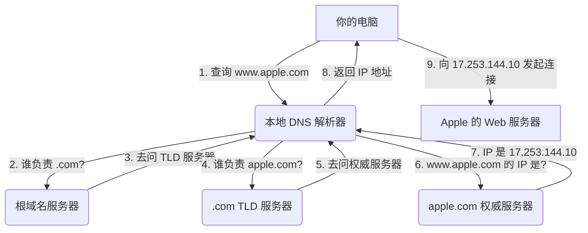

# DNS 查找是如何工作的？

DNS (Domain Name System，域名系统) 是互联网的一项核心基础服务。它的主要职责，是将人类容易记忆的**域名 (Domain Names)**，例如 `www.apple.com`，翻译成计算机网络能够理解的 **IP 地址 (IP Addresses)**，例如 `17.253.144.10`。

你可以把 DNS，想象成是“**互联网的电话簿**”。当你想要访问一个网站时，你的浏览器，首先需要通过查询这个“电话簿”，来找到这个网站所对应的、真实的 IP 地址，然后才能向该地址，发起网络连接请求。

## DNS 的层级结构

DNS 系统，不是一个单一的、巨大的数据库，而是一个全球性的、**分布式的、层级化的**数据库系统。这个层级结构，就像一个倒置的树。

1.  **根域名服务器 (Root Name Servers)**: 位于整个系统的最顶端。全球只有 13 组根服务器（从 `A` 到 `M`），由不同的组织管理。它们不直接知道 `www.apple.com` 的 IP 地址，但它们知道，应该去哪里，查找 `.com` 这个顶级域名的信息。

2.  **顶级域名服务器 (Top-Level Domain, TLD Servers)**: 负责管理特定的顶级域名，如 `.com`, `.org`, `.net`, `.cn` 等。例如，`.com` 的 TLD 服务器，不知道 `www.apple.com` 的 IP 地址，但它知道，应该去哪里，查找 `apple.com` 这个域名的信息。

3.  **权威域名服务器 (Authoritative Name Servers)**: 这是最终负责存储和提供特定域名信息的服务器。例如，`apple.com` 的权威域名服务器，由苹果公司自己管理。它包含了 `www.apple.com`, `api.apple.com` 等所有子域名的、确切的 IP 地址记录。

## DNS 查找的流程

当你在浏览器中，输入 `www.apple.com` 并按下回车时，你的计算机会发起一个“**递归查询 (Recursive Query)**”的过程，来找出其对应的 IP 地址。这个过程，通常由你的**本地 DNS 解析器 (Local DNS Resolver)** 来完成，它通常是由你的互联网服务提供商 (ISP) 或一个公共 DNS 服务（如 Google 的 `8.8.8.8` 或 Cloudflare 的 `1.1.1.1`）提供的。

**查找步骤**: 

1.  **浏览器/操作系统缓存**: 你的电脑，会首先检查自己的**本地缓存**，看看之前是否已经查询过 `www.apple.com`。如果找到了，并且记录没有过期，它就会直接使用这个缓存的 IP 地址，整个查询过程结束。

2.  **本地 DNS 解析器 (Resolver)**: 如果本地缓存中没有，你的电脑，就会向其配置的**本地 DNS 解析器**，发送一个查询请求：“`www.apple.com` 的 IP 地址是什么？”

3.  **解析器查询根服务器**: 本地解析器，会首先向 13 组**根域名服务器**中的一个，发送一个查询：“谁负责 `.com`？”。根服务器会回答：“我不知道 `www.apple.com` 在哪里，但你可以去问 `.com` 的 TLD 服务器，它们的地址是 ...”。

4.  **解析器查询 TLD 服务器**: 本地解析器，接着向 `.com` 的 **TLD 服务器**，发送一个查询：“谁负责 `apple.com`？”。TLD 服务器会回答：“我不知道 `www.apple.com` 在哪里，但你可以去问 `apple.com` 的权威域名服务器，它们的地址是 ...”。

5.  **解析器查询权威域名服务器**: 最后，本地解析器，向 `apple.com` 的**权威域名服务器**，发送一个查询：“`www.apple.com` 的 IP 地址是什么？”。这一次，权威域名服务器，能够给出最终的答案：“`www.apple.com` 的 IP 地址是 `17.253.144.10`”。

6.  **返回结果与缓存**: 本地 DNS 解析器，在获取到这个 IP 地址后，会：
    a.  将这个结果，**缓存**在自己的数据库中，以便下次再有其他用户查询同一个域名时，能够直接返回结果。
    b.  将这个 IP 地址，返回给你的计算机。

7.  **发起连接**: 你的浏览器，在最终获取到 IP 地址后，才会向 `17.253.144.10` 这个地址，发起一个 TCP 连接请求，开始加载网页。

## DNS 记录类型

一个权威域名服务器，不仅仅存储 IP 地址。它还存储了多种不同类型的“**资源记录 (Resource Records)**”。

*   **A 记录**: 最常见的记录。将一个域名，映射到一个 **IPv4** 地址。
*   **AAAA 记录**: 将一个域名，映射到一个 **IPv6** 地址。
*   **CNAME 记录 (Canonical Name)**: 将一个域名（别名），映射到另一个**域名**。例如，`ftp.example.com` 可以是一个指向 `server1.example.com` 的 CNAME。
*   **MX 记录 (Mail Exchange)**: 指定了负责接收该域名电子邮件的**邮件服务器**的地址。
*   **TXT 记录**: 允许管理员，为域名，存储任意的文本信息。常用于域名所有权的验证（如 SPF, DKIM）。

## 总结

*   **DNS 的作用**: 将**域名**，翻译成 **IP 地址**。
*   **核心结构**: 一个全球性的、**分布式的、层级化的**数据库系统（根 -> TLD -> 权威）。
*   **查询流程**: 你的电脑，向**本地解析器**发起一个**递归查询**；本地解析器，则代表你，向根、TLD 和权威服务器，发起一系列的**迭代查询**。
*   **缓存是关键**: 为了效率，DNS 系统的每一层（从你的操作系统，到本地解析器），都进行了大量的**缓存**。

DNS 是我们能够通过简单易记的域名，来访问互联网服务的“幕后英雄”。虽然这个查询过程，看起来有很多步骤，但得益于全球性的缓存系统，它通常在几十毫秒内，就能完成。理解 DNS 的工作原理，是理解整个互联网如何运作的第一步。
