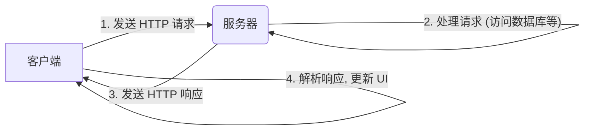

# 客户端-服务器模型 (Client-Server Model)

客户端-服务器模型，是现代网络应用程序最核心、最基础的架构。它将一个应用程序，划分为两个独立但相互协作的部分：**客户端 (Client)** 和 **服务器 (Server)**。我们日常使用的几乎所有互联网服务，从浏览网页、到发送邮件、再到在线游戏，都建立在这个模型之上。

## 核心角色

### 1. 服务器 (Server)

*   **定义**: 服务器是一台（或一个集群）始终在线的、功能强大的计算机。它的主要职责是**提供服务 (Service)** 和**资源 (Resource)**。
*   **特点**:
    *   **被动等待**: 服务器通常是被动地、持续地监听来自网络上的请求。
    *   **数据中心**: 它是数据的“真理之源 (Source of Truth)”。所有核心的业务数据（如用户信息、商品列表、文章内容），都集中存储和管理在服务器的数据库中。
    *   **业务逻辑处理**: 负责执行核心的业务逻辑，例如，验证用户登录、处理订单、进行复杂的计算等。
    *   **无状态 (Stateless)**: 在理想情况下，服务器本身，不应该保存与特定客户端相关的、临时的会话状态。每一个来自客户端的请求，都应该包含足够的信息，以便服务器能够独立地处理它（这是 RESTful API 设计的一个核心原则）。

### 2. 客户端 (Client)

*   **定义**: 客户端是用户直接与之交互的程序。它可以是你的**网页浏览器**、手机上的**移动应用**、桌面上的**应用程序**，甚至是另一个服务器。
*   **特点**:
    *   **主动发起**: 客户端是主动地、按需地，向服务器**发起请求 (Request)** 的一方。
    *   **用户界面 (UI)**: 它的主要职责，是向用户呈现数据（从服务器获取），并接收用户的输入。
    *   **状态管理**: 客户端通常需要管理与用户界面相关的、临时的状态（例如，一个输入框中正在输入的内容）。
    *   **“胖客户端” vs. “瘦客户端”**: 
        *   **瘦客户端**: 只负责最基本的 UI 展示和用户输入，几乎所有的业务逻辑，都在服务器端处理（例如，传统的 Web 页面）。
        *   **胖客户端**: 会在本地，处理大量的业务逻辑和数据（例如，一个大型的 3D 游戏客户端）。

## 交互流程：请求-响应循环 (Request-Response Cycle)

客户端和服务器之间的交互，遵循一个简单而强大的“**请求-响应**”模式。

1.  **建立连接**: 客户端，首先需要知道服务器的 **IP 地址**（通过 DNS 查询）和**端口号 (Port)**。然后，它通过一个网络协议（通常是 TCP），与服务器建立一个连接。

2.  **客户端发送请求**: 客户端，按照一个预先定义好的**应用层协议**（最常见的是 **HTTP**），构建一个“**请求 (Request)**”消息，并将其发送给服务器。这个请求消息中，通常包含了：
    *   **请求方法 (Method)**: `GET` (获取数据), `POST` (提交数据), `PUT` (更新数据), `DELETE` (删除数据)。
    *   **目标资源路径 (Path)**: 例如 `/users/123`。
    *   **头部 (Headers)**: 包含了元数据，如认证信息、期望的内容类型等。
    *   **正文 (Body)**: 对于 `POST` 或 `PUT` 请求，包含了要发送给服务器的数据（例如，一个 JSON 对象）。

3.  **服务器处理请求**: 服务器在接收到请求后：
    *   解析请求，理解客户端的意图。
    *   执行相应的业务逻辑（例如，从数据库中，查询 ID 为 123 的用户信息）。
    *   构建一个“**响应 (Response)**”消息。

4.  **服务器发送响应**: 服务器，将响应消息，发送回客户端。这个响应消息中，通常包含了：
    *   **状态码 (Status Code)**: `200 OK` (成功), `404 Not Found` (未找到), `500 Internal Server Error` (服务器内部错误) 等。
    *   **头部 (Headers)**: 包含了元数据，如内容的类型、长度等。
    *   **正文 (Body)**: 包含了客户端请求的数据（例如，那个用户的 JSON 信息）。

5.  **客户端处理响应**: 客户端在接收到响应后，会解析其内容，并据此来更新自己的 UI 或状态（例如，将获取到的用户信息，显示在屏幕上）。

6.  **关闭连接**: 连接被关闭。

## 客户端-服务器模型的演进

*   **传统的 Web 应用**: 客户端（浏览器）非常“瘦”。几乎每一次交互，都需要向服务器，发起一次完整的页面请求，服务器则返回一个新的 HTML 页面。
*   **单页应用 (Single-Page Applications, SPA)**: 客户端（通常是一个 JavaScript 框架，如 React, Vue）变得更“胖”。页面的初始加载后，客户端只通过 **AJAX**，向服务器请求**纯数据 (JSON)**，然后在客户端，动态地、局部地更新 UI，而无需刷新整个页面。
*   **移动应用**: 与 SPA 类似，移动应用，通常也只与服务器，进行纯数据的交换。
*   **实时应用**: 对于需要实时、双向通信的应用（如在线聊天、协作文档），除了请求-响应模型，还会使用像 **WebSockets** 这样的技术，来在客户端和服务器之间，建立一个**持久的、双向的**连接。

## 总结

*   **关注点分离**: 客户端-服务器模型，实现了**用户界面**与**数据和业务逻辑**的清晰分离。这使得两端，可以独立地进行开发、部署和扩展。
*   **集中式数据管理**: 所有核心数据，都集中存储在服务器上，这保证了**数据的一致性**和**安全性**。
*   **可扩展性**: 你可以有数百万个客户端，同时连接到少数几个（或一个集群）强大的服务器上。
*   **请求-响应**: 客户端和服务器之间，通过一个标准化的“**请求-响应**”循环，来进行通信，其最常见的协议，是 **HTTP**。

客户端-服务器模型，是构建可扩展、可维护的网络应用程序的、最基本、最重要的架构模式。理解这个模型中，客户端和服务器各自的职责，以及它们之间清晰的交互边界，是进行任何网络编程或系统设计的第一步。
