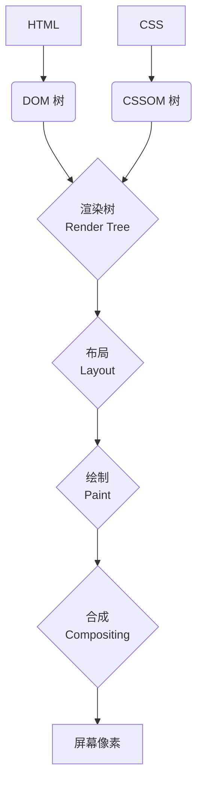

# 浏览器是什么？

网页浏览器（Web Browser），是我们访问和体验万维网（World Wide Web）的主要入口。它是一个极其复杂的应用程序，其核心任务，是向服务器**请求**网页资源，然后**解析**和**渲染**这些资源，最终将一个可交互的、可视化的页面，呈现给用户。

理解浏览器的工作原理，是进行任何现代 Web 开发的基础。

## 浏览器的高层架构

一个现代的浏览器，通常由以下几个核心组件构成：

1.  **用户界面 (User Interface)**: 这是你所能看到和与之交互的部分，包括地址栏、前进/后退按钮、书签菜单等。它与页面显示的核心部分是分离的。

2.  **浏览器引擎 (Browser Engine)**: 这是协调和管理其他所有核心组件的“总指挥”。它负责在**渲染引擎**和**网络层**之间，传递指令。

3.  **渲染引擎 (Rendering Engine)**: 这是浏览器的核心，负责**解析和渲染**网页内容。当它从网络层，接收到 HTML, CSS, JavaScript 等资源后，它会经过一系列复杂的步骤，来将这些代码，转换为屏幕上你所看到的、可视化的像素。
    *   **主流的渲染引擎**: 
        *   **Blink**: 由 Google 主导开发，用于 Chrome, Edge, Opera 等。
        *   **WebKit**: 由苹果主导开发，用于 Safari。Blink 最初就是 WebKit 的一个分支。
        *   **Gecko**: 由 Mozilla 开发，用于 Firefox。

4.  **网络层 (Networking)**: 负责处理所有的网络通信，例如，发起 HTTP 请求、下载网页资源等。

5.  **JavaScript 引擎 (JavaScript Engine)**: 负责**解析和执行** JavaScript 代码。这是一个高度优化的组件，通常包含了解释器、JIT 编译器、垃圾回收器等。
    *   **主流的 JS 引擎**: 
        *   **V8**: Google 开发，用于 Chrome 和 Node.js。
        *   **SpiderMonkey**: Mozilla 开发，用于 Firefox。
        *   **JavaScriptCore**: 苹果开发，用于 Safari。

6.  **UI 后端 (UI Backend)**: 用于绘制最基本的 UI 部件，如窗口、按钮、输入框等。它调用底层操作系统的 UI API。

7.  **数据持久化层 (Data Persistence)**: 负责在本地硬盘上，存储各种数据，如 Cookies, localStorage, IndexedDB, 以及浏览器缓存。

## 关键渲染路径 (Critical Rendering Path)

当你在浏览器中，输入一个 URL 并按下回车后，渲染引擎，会执行一个被称为“关键渲染路径”的、一系列的步骤，来将代码，转换为屏幕上的像素。

1.  **解析 HTML -> 构建 DOM 树**: 渲染引擎，首先会解析 HTML 文档，并根据其标签的层级关系，在内存中，构建一个“**文档对象模型 (Document Object Model, DOM)**”树。DOM 树，是 HTML 文档的一个面向对象的、内存中的表示。

2.  **解析 CSS -> 构建 CSSOM 树**: 同时，渲染引擎，会解析所有的 CSS 代码（包括外部 CSS 文件和内联样式），并构建一个“**CSS 对象模型 (CSS Object Model, CSSOM)**”树。CSSOM 树，包含了页面上所有元素的样式信息。

3.  **合并 DOM 和 CSSOM -> 构建渲染树 (Render Tree)**: 渲染引擎，会将 DOM 树和 CSSOM 树，合并在一起，来创建一个“**渲染树**”。渲染树，只包含那些**需要被显示**在页面上的节点（例如，`display: none` 的节点，就不会出现在渲染树中），以及它们最终计算出的样式。

4.  **布局 (Layout / Reflow)**: 在这个阶段，渲染引擎，会遍历渲染树，并为每一个节点，计算出其在屏幕上的**精确位置和大小**。这个过程，也被称为“回流 (Reflow)”。它会输出一个包含了所有可见元素的几何信息的“**盒模型 (Box Model)**”。

5.  **绘制 (Paint)**: 在这个阶段，渲染引擎，会遍历渲染树，并将每一个节点，转换为一系列的、独立的“**绘制指令**”，并将其记录到一个“**绘制记录 (Paint Record)**”中。例如，“在坐标 (x, y) 处，画一个蓝色的矩形”。

6.  **合成 (Compositing)**: 这是现代浏览器为了性能，而进行的一项重要优化。渲染引擎，会将页面，分解成多个“**图层 (Layers)**”。例如，一个有 `transform: translateZ(0)` 样式的元素，通常会被提升到一个独立的图层。然后，它会将每一个图层，都独立地进行光栅化。

7.  **光栅化 (Rasterization)**: **GPU** 会接管工作，将每个图层的绘制指令，转换为屏幕上的**像素**。

8.  **显示**: 最后，合成器线程，会将所有这些已经光栅化好的图层，按照正确的顺序，**合成**在一起，并最终显示在屏幕上。

**为什么合成是重要的优化？**

因为像“变换 (transform)”或“不透明度 (opacity)”这样的动画，如果是在一个独立的图层上进行，那么它就**不需要**重新触发布局和绘制这两个昂贵的步骤。浏览器只需要在 GPU 上，重新合成现有的图层即可，这使得动画，能够达到极高的帧率（60fps）。

## 总结

*   浏览器是一个极其复杂的、由多个核心组件构成的**复合型应用程序**。
*   **渲染引擎**是其核心，负责将 HTML, CSS, JS，转换为屏幕上的像素。
*   **关键渲染路径**，是一个“**解析 -> 计算样式 -> 布局 -> 绘制 -> 合成**”的流水线过程。
*   **DOM** 和 **CSSOM** 是 HTML 和 CSS 在内存中的对象表示。
*   现代浏览器，通过**图层合成**和 **GPU 加速**，来极大地优化渲染性能，特别是动画的流畅度。

理解浏览器的工作原理，特别是关键渲染路径，对于前端开发者来说，是编写高性能、不卡顿的网页和应用的理论基础。它能帮助你理解，为什么某些 CSS 属性的动画，会比其他属性的动画，要快得多，以及如何去诊断和优化页面的渲染性能。
