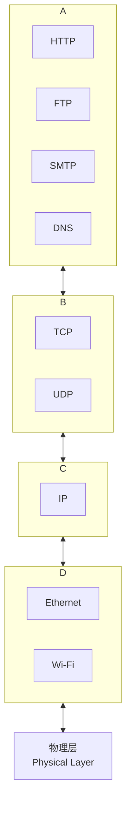

# 网络基础：协议 (Protocols)

在计算机网络中，**协议 (Protocol)** 是一套**规则和约定**的集合，它定义了网络中的两个或多个实体（例如，两台计算机、一个客户端和一个服务器）之间，应该如何进行通信。协议，是网络通信的“**共同语言**”。

如果没有协议，网络通信，就会像两个说着不同语言、又没有任何共同手势的人进行交流一样，陷入一片混乱。协议，为数据的**格式**、**顺序**、**含义**以及**错误处理**，都提供了明确的、无歧义的规范。

## 网络协议栈：分层模型 (Layered Model)

现代的计算机网络，不是由一个单一的、巨大的协议来定义的。相反，它被设计成一个**分层的、模块化的“协议栈 (Protocol Stack)”**。每一层，都只负责处理一个特定的、独立的通信任务，并为其上一层，提供服务。

最常见的网络模型，是 **TCP/IP 五层模型**（或 OSI 七层模型）。

**数据封装 (Data Encapsulation)**: 
当一个应用程序，发送数据时，数据会从协议栈的顶层（应用层），逐层向下传递。在每一层，该层的协议，都会在数据的前面，添加上自己的“**头部 (Header)**”（包含了该层的控制信息），这个过程，被称为“封装”。最终，在物理层，数据以原始的比特流，在网络介质上传输。

当接收方，收到数据时，则会进行一个相反的、“解封装”的过程。

## 核心协议详解

### 1. 应用层 (Application Layer)

这是开发者最常直接打交道的层面。它定义了**应用程序之间，如何交换数据**。

*   **HTTP (HyperText Transfer Protocol)**: 超文本传输协议，是万维网的基础。用于浏览器和 Web 服务器之间，请求和传输网页内容。
*   **FTP (File Transfer Protocol)**: 文件传输协议，用于在客户端和服务器之间，上传和下载文件。
*   **SMTP (Simple Mail Transfer Protocol)**: 简单邮件传输协议，用于发送电子邮件。
*   **DNS (Domain Name System)**: 域名系统，用于将域名，翻译成 IP 地址。

### 2. 传输层 (Transport Layer)

传输层，负责在**两个进程**之间，提供端到端的通信服务。它主要有两个核心协议：

*   **TCP (Transmission Control Protocol)**: 
    *   **可靠的、面向连接的**协议。
    *   **三次握手**: 在传输数据之前，需要先通过“三次握手”，来建立一个可靠的连接。
    *   **可靠性保证**: 它提供了**错误校验、丢包重传、顺序保证**和**流量控制**等机制，来确保数据能够准确无误地、按顺序地，从发送方，到达接收方。
    *   **应用**: 适用于所有要求**高可靠性**的应用，如网页浏览、文件传输、电子邮件。

*   **UDP (User Datagram Protocol)**: 
    *   **不可靠的、无连接的**协议。
    *   **“发射后不管”**: 它不建立连接，也不提供任何可靠性保证。数据包（被称为“数据报, Datagram”）可能会丢失、重复或乱序到达。
    *   **优点**: **速度快**，延迟低，开销小。
    *   **应用**: 适用于那些能够容忍少量丢包、但对**实时性**要求极高的应用，如**在线游戏、视频会议、实时流媒体**。

### 3. 网络层 (Network Layer)

网络层，负责在**两台主机**之间，进行**数据包 (Packets)** 的路由和转发。

*   **IP (Internet Protocol)**: 网际协议，是网络层的核心。它定义了“**IP 地址**”，为互联网上的每一台主机，都分配了一个唯一的地址。IP 协议，负责将数据包，从源主机，通过一个个的路由器，最终投递到目标主机。但是，IP 协议本身，是**不可靠的、尽力而为 (best-effort)** 的。

### 4. 数据链路层 & 物理层 (Data Link & Physical Layers)

*   **数据链路层**: 负责在**同一个物理网络**（例如，一个局域网）内的、**相邻的两个节点**之间，传输“**帧 (Frames)**”。它处理物理地址（**MAC 地址**）的寻址。
    *   **协议**: 以太网 (Ethernet), Wi-Fi。
*   **物理层**: 负责在物理媒介（如铜线、光纤、无线电波）上，传输原始的**比特流 (0 和 1)**。

## 总结

*   **协议**是网络通信的**规则和语言**。
*   现代网络，采用**分层**的**协议栈**模型，实现了**关注点分离**和**模块化**。
*   **TCP/IP 五层模型**是最核心的参考模型：
    *   **应用层 (HTTP, DNS)**: 定义**应用程序**如何沟通。
    *   **传输层 (TCP, UDP)**: 提供**进程到进程**的、**可靠或不可靠**的通信。
    *   **网络层 (IP)**: 负责**主机到主机**的、跨网络的**数据包路由**。
    *   **链路层/物理层**: 负责在**相邻节点**之间，传输**帧**和**比特**。

理解这个分层模型，是理解任何网络问题的基础。例如，当你无法访问一个网站时：
*   可能是 **DNS** 问题（应用层）。
*   可能是服务器的 **TCP** 端口不通（传输层）。
*   可能是你的 **IP** 路由配置错误（网络层）。
*   也可能只是你的 **Wi-Fi** 断了（链路层/物理层）。

通过将一个复杂的问题，分解到不同的层次去分析，我们才能更系统、更有效地，去诊断和解决网络世界中的各种疑难杂症。
