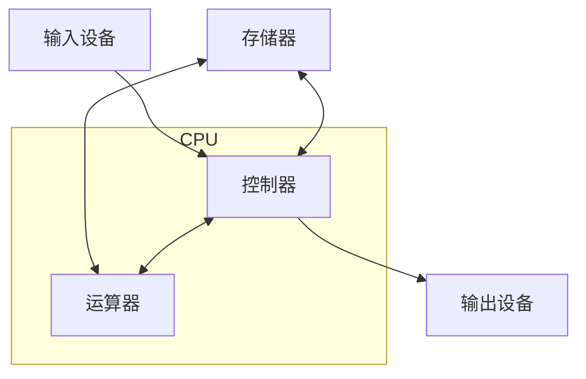

# 计算机基础：计算机组成原理

计算机组成原理，是研究一台计算机**硬件系统**的**基本构成**和**工作原理**的学科。它关注的是，从程序员的视角来看，一个计算机系统，在宏观层面，是如何被组织起来的。它为我们理解“软件是如何在硬件上运行的”这一根本问题，提供了基础的框架。

现代计算机，其设计，都遵循着由数学家约翰·冯·诺依曼所提出的“**冯·诺依曼体系结构**”。

## 冯·诺依曼体系结构

这个体系结构，定义了一台计算机，必须由以下五个核心组件构成：

1.  **运算器 (Arithmetic Logic Unit, ALU)**: 负责执行所有的**算术运算**（如加、减、乘、除）和**逻辑运算**（如与、或、非）。它是计算机的“计算核心”。

2.  **控制器 (Control Unit)**: 负责**指挥和协调**计算机所有组件的工作。它会从内存中，读取指令，对其进行**解码**，然后根据指令的含义，向其他组件（如运算器、内存、I/O 设备），发出控制信号。

3.  **存储器 (Memory)**: 用于**存储程序指令**和**数据**。冯·诺依曼体系结构的一个核心思想，就是“**存储程序 (Stored-program Computer)**”，即程序本身，和它所要处理的数据，都以同样的方式，存储在内存中。

4.  **输入设备 (Input Devices)**: 用于向计算机，输入信息。例如，键盘、鼠标、触摸屏、麦克风。

5.  **输出设备 (Output Devices)**: 用于从计算机，获取处理结果。例如，显示器、打印机、扬声器。

在现代计算机中，**运算器**和**控制器**，通常被集成在同一块芯片上，我们称之为“**中央处理器 (Central Processing Unit, CPU)**”。而输入和输出设备，则被统称为 **I/O 设备**。

## CPU 的工作原理：取指-执行循环

CPU 的核心工作，就是不断地、循环地，执行以下三个基本步骤，这被称为“**取指-执行循环 (Fetch-Execute Cycle)**”：

1.  **取指 (Fetch)**: 控制器，根据**程序计数器 (Program Counter, PC)** 寄存器中，所存储的地址，从内存中，读取下一条将要执行的**指令**。

2.  **解码 (Decode)**: 控制器，对读取到的指令（一串二进制的机器码），进行解码，以确定这是一条什么指令（例如，是一条加法指令，还是一条内存加载指令），以及它的操作数是什么。

3.  **执行 (Execute)**: 控制器，向其他相关组件，发出控制信号，来执行这条指令。例如：
    *   如果是一条 `ADD` 指令，它会命令运算器，执行一次加法运算。
    *   如果是一条 `LOAD` 指令，它会命令存储器，从某个内存地址，读取数据到 CPU 的寄存器中。

在执行完一条指令后，PC 寄存器，会自动地指向下一条指令的地址，然后，整个循环，再次开始。

## 存储器层次结构 (Memory Hierarchy)

计算机的存储器，不是单一的。相反，它是一个**多层次的、金字塔形**的结构。从上到下，其**速度越来越慢**，**容量越来越大**，但**每字节的成本，也越来越低**。

1.  **寄存器 (Registers)**: 位于 CPU 芯片的**最内部**，速度**最快**，但容量极小（通常只有几百字节到几千字节）。

2.  **CPU 缓存 (Caches - L1, L2, L3)**: 位于 CPU 芯片上或芯片附近的高速 SRAM 存储器。用于缓存从主内存中，频繁读取的数据，以弥补 CPU 与主内存之间的巨大速度鸿沟。

3.  **主内存 (Main Memory / RAM)**: 即我们通常所说的“内存条”。它是程序指令和数据，在运行时，所驻留的地方。它的速度，远慢于 CPU 缓存。

4.  **二级存储 (Secondary Storage)**: **硬盘 (HDD)** 或 **固态硬盘 (SSD)**。用于**持久化**地存储操作系统、应用程序和用户文件。它的容量最大，但速度也最慢。

**局部性原理 (Principle of Locality)**: 
整个存储器层次结构，之所以能够高效地工作，是基于一个重要的“局部性原理”：
*   **时间局部性 (Temporal Locality)**: 如果一个数据项，刚刚被访问过，那么它在不久的将来，很可能还会被再次访问。
*   **空间局部性 (Spatial Locality)**: 如果一个数据项被访问，那么与它相邻的数据项，也很可能即将被访问。

操作系统和 CPU 硬件，会利用这个原理，智能地，将程序即将需要的数据，从慢速的存储器，“**预取 (Prefetch)**”到高速的缓存中，从而使得大多数的内存访问，都能够在高速缓存中“**命中 (Hit)**”。

## 总线 (Bus)

总线，是连接计算机各个核心组件（CPU, 内存, I/O 设备）的“**公共信息通道**”。它是一组并行的导线，用于在这些组件之间，传输地址、数据和控制信号。

## 总结

*   现代计算机，都基于“**冯·诺依曼体系结构**”，其核心是**运算器、控制器、存储器**和 **I/O 设备**。
*   **CPU**（运算器 + 控制器）的工作，是一个永不停止的“**取指-解码-执行**”循环。
*   “**存储程序**”思想，意味着程序指令和数据，都同样地存储在**存储器**中。
*   **存储器层次结构**，通过使用多级**缓存**，来解决 CPU 与主内存之间的速度差异，其有效性，依赖于程序的“**数据局部性**”。
*   **总线**是连接所有硬件组件的“**信息高速公路**”。

计算机组成原理，为我们提供了一个关于“计算机是如何工作的”的、宏观的、硬件层面的视图。它与“操作系统原理”（软件层面的资源管理器）和“计算机网络”（多台计算机如何通信）等学科一起，共同构成了整个计算机科学的基石。对于任何希望超越“应用层开发”、深入理解系统底层的开发者来说，这些基础知识，都是不可或缺的。
